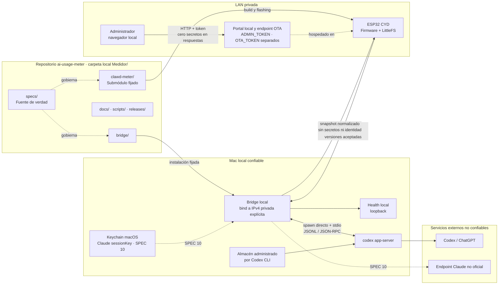

# SPEC 00 — Arquitectura, alcance y seguridad

> **Estado:** Approved
> **Depende de:** Ninguna
> **Fecha:** 2026-07-21
> **Fuente base:** `docs/AI_USAGE_METER_ESP32_SPEC_DRIVEN_PLAN_V2.md`
> **Repositorio canónico:** `ai-usage-meter`
> **Carpeta local esperada:** `Medidor/`
> **Repositorio de firmware:** `clawd-meter`
> **Objetivo:** Fijar la arquitectura, el alcance, el modelo de seguridad, la compatibilidad y las reglas de coordinación del AI Usage Meter para que SPEC 01–12 se implementen sin reinterpretar decisiones fundamentales.

## 1. Carácter normativo y ciclo de vida

El plan V2 es una fuente de diseño. Los SPEC aprobados son los contratos vinculantes del proyecto.

Mientras este documento permanezca en estado `Draft` o `Review`, ADR-001 a ADR-007 tienen estado `Proposed`. Al aprobar SPEC 00, esos ADR cambian conjuntamente a `Accepted`. Un ADR aceptado no se modifica de forma silenciosa: cualquier cambio requiere un ADR posterior que documente motivación, impacto, migración, compatibilidad y rollback.

### 1.1 Estados de un SPEC

| Estado | Significado | Autoridad de transición |
| --- | --- | --- |
| `Draft` | Documento en elaboración; puede contener cambios pendientes de revisión. | Autor del SPEC |
| `Review` | Documento completo sometido a revisión; no permite implementación. | Autor del SPEC |
| `Approved` | Alcance y decisiones cerrados; habilita implementación si sus dependencias están verificadas. | Propietario del proyecto |
| `Implementing` | Implementación en curso conforme al SPEC aprobado. | Responsable de implementación |
| `Implemented` | Código y artefactos terminados; falta verificación independiente. | Responsable de implementación |
| `Implemented-Verified` | Estado terminal: implementación completa con evidencia y checks aprobados por un revisor distinto del implementador o por el propietario del proyecto. | Revisor o propietario del proyecto |

Reglas:

- Ningún SPEC puede pasar a `Approved` con decisiones abiertas, marcadores pendientes o criterios no verificables.
- Ningún cambio de comportamiento puede implementarse contra una versión `Draft` o `Review`.
- Si cambia un SPEC `Approved`, vuelve a `Review`; la implementación afectada queda bloqueada hasta nueva aprobación.
- Una corrección editorial que no cambia comportamiento, seguridad, datos, contratos ni criterios puede registrarse sin invalidar la aprobación.
- La aprobación y la verificación deben quedar registradas en el encabezado o en la evidencia canónica definida por el workflow.
- Los documentos de SPEC posteriores pueden redactarse en paralelo, pero su implementación queda sujeta a las dependencias de la sección 9.

## 2. Identidad de repositorios y propiedad de rutas

Los nombres canónicos son:

- Repositorio coordinador: `ai-usage-meter`.
- Carpeta local recomendada del repositorio coordinador: `Medidor/`.
- Repositorio de firmware: `clawd-meter`.
- Submódulo del firmware dentro del coordinador: `Medidor/clawd-meter/`.
- Directorio documental canónico: `docs/`, siempre en minúsculas.
- Remoto canónico de `clawd-meter`: el remoto `origin` del fork al que apunta el submódulo; todo commit, tag o puntero referenciado por SPEC, manifiestos o matriz debe existir en ese remoto. El remoto `upstream` (proyecto original) es solo de referencia y nunca es destino de pushes ni fuente de verdad de releases.

`Medidor/` es una carpeta local, no el nombre lógico del repositorio. Los manifiestos y documentación deben usar `ai-usage-meter` como identidad canónica y pueden mencionar `Medidor/` únicamente como ruta local.

### 2.1 Propiedad de rutas

| Ruta canónica | Repositorio | Propietario funcional | Versionada | Contenido generado | Secretos permitidos |
| --- | --- | --- | ---: | ---: | ---: |
| `specs/` | `ai-usage-meter` | Arquitectura y producto | Sí | No | No |
| `specs/.spec-config.yml` | `ai-usage-meter` | Workflow de SPEC | Sí | No | No |
| `bridge/` | `ai-usage-meter` | Runtime macOS | Sí | Parcialmente | No |
| `docs/` | `ai-usage-meter` | Documentación | Sí | Parcialmente | No |
| `scripts/` | `ai-usage-meter` | Automatización | Sí | No | No |
| `releases/manifests/` | `ai-usage-meter` | Release | Sí | Sí | No |
| `releases/evidence/` | `ai-usage-meter` | Verificación | Sí, salvo artefactos grandes externos | Sí | No |
| `releases/artifacts/` | `ai-usage-meter` o almacenamiento de release | Release | Según SPEC 12 | Sí | No |
| `.github/` o CI equivalente | `ai-usage-meter` | Integración continua | Sí | No | No |
| `.gitmodules` | `ai-usage-meter` | Coordinación Git | Sí | No | No |
| `clawd-meter/` | puntero en `ai-usage-meter`; contenido en `clawd-meter` | Firmware | Sí | Compilados fuera del árbol fuente | No |
| Código, assets y configuración del firmware | `clawd-meter` | Firmware ESP32 | Sí | Parcialmente | No |
| Archivos runtime de secretos | Fuera de ambos repositorios | Operador local | No | No | Sí |

### 2.2 Entregable de SPEC 00

El único entregable normativo de este SPEC es:

```text
Medidor/specs/00-arquitectura-alcance-seguridad.md
```

`specs/.spec-config.yml` está gobernado por este documento, pero su creación o modificación operativa corresponde a SPEC 01. SPEC 00 no modifica código del bridge, firmware, CI ni configuración Git.

## 3. Alcance

### 3.1 Dentro de SPEC 00

- Definir objetivo y alcance funcional de V1.
- Establecer arquitectura completa: Codex App Server, bridge local, API HTTP, ESP32 y futura integración Claude.
- Declarar `ai-usage-meter` como repositorio coordinador y fuente de verdad de contratos.
- Declarar `clawd-meter/` como submódulo Git obligatorio.
- Fijar propiedad de rutas, commits, evidencias y releases entre ambos repositorios.
- Definir ciclo de vida de SPEC y ADR.
- Incluir diagrama Mermaid y descripción textual equivalente.
- Definir límites de confianza, threat model, flujo, propiedad, rotación y revocación de secretos.
- Establecer LAN privada, HTTP y Bearer token como modelo V1.
- Definir bind de red, validación de URL y prohibición de redirects.
- Definir negociación mínima de compatibilidad.
- Separar conectividad, salud del bridge, estado de proveedor y frescura.
- Definir comportamiento degradado para Mac, bridge, App Server, proveedor, autenticación y payload incompatibles.
- Ordenar SPEC 01–12 por fases y dependencias.
- Definir manifiesto, matriz y evidencia reproducible.
- Establecer Definition of Done global binaria.

### 3.2 Alcance funcional de V1

- Mostrar consumo Codex/ChatGPT Plus de ventana principal y semanal.
- Mostrar porcentaje usado y restante, momento de reinicio, conectividad y antigüedad.
- Mantener firmware, touch, canales, animaciones, reloj y clima existentes.
- Incorporar Claude mediante el bridge después del endurecimiento del portal.
- Mantener funciones locales cuando bridge o Mac no estén disponibles.
- Persistir únicamente el último snapshot normalizado, acotado y sin secretos para poder mostrarlo como `stale` después de un reinicio.
- Impedir credenciales ChatGPT/Codex y Claude en el ESP32.
- Proteger rutas administrativas, recuperación, OTA y Setup AP antes del release.
- Soportar exactamente un ESP32 registrado por instancia de bridge en V1.

### 3.3 Fuera de SPEC 00

- Inicializar Git, configurar remotos o convertir `clawd-meter/` en submódulo; corresponde a SPEC 01.
- Implementar bridge, firmware, UI, autenticación o servicio macOS.
- Fijar todos los campos del payload de `/api/v1/usage`; corresponde a SPEC 05.
- Ejecutar builds, flashing, pruebas de hardware o soak test.
- Implementar endurecimiento del portal, OTA o Setup AP.
- Configurar credenciales Claude reales.
- Generar artefactos de release.

### 3.4 Fuera de V1

- Exponer el bridge a Internet.
- HTTPS, CA privada o certificate pinning.
- Aplicación móvil.
- Base de datos o historial complejo.
- Multiusuario, varios hogares o más de un ESP32 por bridge.
- Proveedores distintos de Codex y Claude.
- Ejecutar prompts, conversaciones o tareas desde ESP32.
- Administrar cuentas, créditos o resets de servicios externos.
- Distribución comercial con mascota o marcas actuales.
- Backup exportable de secretos.
- Rotación de token sin una interrupción breve de mantenimiento.

## 4. Arquitectura objetivo



Descripción textual normativa:

1. `ai-usage-meter/specs/` gobierna contratos, seguridad, compatibilidad y releases.
2. `bridge/` se ejecuta en la Mac y escucha únicamente en una dirección IPv4 RFC1918 configurada de forma explícita.
3. El health check de lifecycle se expone solo en loopback y no revela versiones, rutas, secretos ni errores internos.
4. El bridge inicia `codex app-server` mediante ejecución directa, nunca mediante shell, y se comunica únicamente por `stdio`.
5. Codex App Server usa el almacén de autenticación administrado por Codex CLI.
6. ESP32 consulta el bridge por LAN privada con Bearer token, Device ID y versiones de schema aceptadas.
7. El bridge devuelve únicamente snapshot normalizado, estados y tiempos permitidos.
8. El ESP32 calcula localmente el estado de transporte; un bridge apagado no puede reportar su propio estado `offline`.
9. SPEC 10 agrega Claude usando una credencial nueva almacenada en Keychain; la credencial nunca se envía al ESP32.
10. `clawd-meter/` conserva historial independiente y llega al dispositivo mediante build y flashing reproducibles.
11. El ESP32 hospeda un portal local y un endpoint OTA autenticados con tokens separados (`ADMIN_TOKEN` y `OTA_TOKEN`); el administrador accede por LAN y únicamente puede modificar configuración local, sin administrar bridge, cuentas externas ni exponer secretos.

## 5. Contratos de datos, estado y compatibilidad

SPEC 00 no fija el payload completo. Fija semántica mínima obligatoria que SPEC 04–07 deben concretar sin contradecirla.

### 5.1 Dimensiones de estado

Las siguientes dimensiones son independientes y no deben colapsarse en un único campo:

| Dimensión | Calculada por | Valores mínimos | Significado |
| --- | --- | --- | --- |
| `transport_status` | ESP32 | `connected`, `offline`, `auth_failed`, `invalid_response`, `incompatible_schema` | Resultado actual del intento HTTP |
| `bridge_health` | Bridge y último payload válido | `ok`, `degraded` | Salud interna del bridge cuando pudo responder |
| `provider_status` | Bridge, por proveedor | `ok`, `stale`, `error`, `auth_required`, `unavailable`, `disabled` | Estado independiente de Codex o Claude |
| `freshness` | Bridge y ESP32, por proveedor | `fresh`, `stale`, `unknown`, `no_data` | Calidad temporal del dato |
| `cache_source` | ESP32 | `live`, `memory_cache`, `persistent_cache`, `none` | Origen de lo mostrado |

Reglas:

- `BRIDGE OFFLINE` se deriva exclusivamente de `transport_status=offline`.
- El último `bridge_health=ok` no puede ocultar un fallo de transporte posterior.
- Un proveedor puede fallar sin degradar al otro.
- Nunca se representa ausencia o error como `0%`.
- Un snapshot persistido solo puede contener campos normalizados y no sensibles.
- Después de reiniciar sin reloj confiable, un snapshot persistido se muestra como `freshness=unknown` o `stale`, nunca como `fresh`.

### 5.2 Semántica temporal

- Todos los timestamps de API usan UTC en formato RFC 3339.
- Cada proveedor incluye un momento de observación equivalente a `observed_at`.
- La frescura es independiente por proveedor.
- El bridge define un `max_age_seconds` efectivo por snapshot o proveedor.
- Durante la misma sesión, el ESP32 calcula edad mediante reloj monotónico desde la recepción.
- Después de reiniciar, el ESP32 usa reloj UTC solo si está sincronizado.
- Si el reloj UTC no es confiable, el dato persistido nunca se clasifica como `fresh`.
- SPEC 04 fija valores por defecto y límites de `max_age_seconds`; SPEC 05 fija los nombres exactos de campos.

### 5.3 Semántica de consumo

- La representación canónica incluye porcentaje usado.
- El porcentaje restante se deriva como `100 - used_percent`.
- Valores ausentes permanecen ausentes.
- Valores no numéricos, no finitos o fuera de `0..100` invalidan esa ventana; no se corrigen silenciosamente.
- La ventana principal y la semanal se clasifican por semántica y duración, no por posición en una lista.
- El reinicio se conserva como timestamp UTC cuando la fuente lo permita.
- La UI puede mostrar hora local, pero el contrato y la evidencia usan UTC.
- La referencia manual para verificar Codex es la salida contemporánea del comando o pantalla `/status` de Codex CLI, capturada en la misma cuenta y dentro del `max_age_seconds` efectivo.

### 5.4 Contrato HTTP mínimo

```http
GET /api/v1/usage
Authorization: Bearer <DEVICE_TOKEN>
X-Device-Id: <DEVICE_ID>
X-Accept-Schema-Versions: 1
X-Firmware-Version: <SEMVER>
Accept: application/json
```

Reglas:

- `X-Accept-Schema-Versions` contiene una lista separada por comas de enteros positivos.
- El bridge selecciona la versión compatible más alta.
- La respuesta incluye exactamente una `schema_version` seleccionada.
- Si no existe intersección, el bridge responde `406 Not Acceptable` con un error acotado y sin datos sensibles.
- El ESP32 rechaza cualquier respuesta cuya versión no haya declarado como aceptada.
- `X-Firmware-Version` es diagnóstico y compatibilidad; no autentica.
- `X-Device-Id` identifica un dispositivo registrado; no sustituye el Bearer token.
- SPEC 05 fija payload, códigos, límites, rate limiting y errores exactos compatibles con estas reglas.

### 5.5 Identidad del dispositivo

V1 admite exactamente un registro activo por bridge.

- `DEVICE_ID` cumple `^[A-Za-z0-9][A-Za-z0-9._-]{2,63}$`.
- No se usa la MAC como identificador expuesto.
- `DEVICE_TOKEN` está vinculado al único `DEVICE_ID` configurado.
- Una petición con token válido y Device ID distinto se rechaza.
- Device ID es pseudónimo no secreto; los logs pueden registrar una versión truncada o hash estable.
- El cambio de Device ID exige reprovisión autenticada.
- El rate limiting combina origen de red y Device ID para evitar depender únicamente de uno de ellos.

### 5.6 Versionado

| Elemento | Regla |
| --- | --- |
| `/api/v1` | Familia mayor del protocolo HTTP. Cambia solo si la negociación de schema ya no puede preservar el protocolo. |
| `schema_version` | Incrementa ante cambios incompatibles de payload o semántica. |
| Versión bridge | SemVer del runtime macOS. |
| Versión firmware | SemVer y tag del repositorio `clawd-meter`. |
| `config_version` | Versiona settings persistidos del ESP32 y bridge. |
| `cache_version` | Versiona snapshot persistente y permite descartarlo de forma segura. |
| `manifest_version` | Versiona el formato de manifiesto de release. |

Cambios aditivos opcionales pueden conservar `schema_version` si clientes antiguos pueden ignorarlos sin cambiar significado. Cambios incompatibles incrementan `schema_version`. Downgrade o migración de configuración se define en el SPEC propietario; si no existe migración segura, se exige descarte controlado y reprovisión.

## 6. Comportamiento degradado

El firmware no se reinicia, congela ni bloquea canales locales por fallos del bridge.

| Condición | Datos de uso mostrados | Estado UI | Caché | Reintento |
| --- | --- | --- | --- | --- |
| Respuesta válida y fresca | Snapshot nuevo | Conectado | Actualiza memoria y persistencia atómica | Intervalo normal |
| Respuesta válida con proveedor degradado | Último dato válido de ese proveedor si existe | Proveedor degradado o stale | Conserva dato válido; actualiza estados | Backoff de proveedor definido por bridge |
| Bridge alcanzable, App Server caído | Último snapshot Codex si existe | Bridge degradado; Codex no disponible | Conserva snapshot | Backoff acotado |
| Codex requiere autenticación | Último snapshot Codex si existe | `AUTH REQUIRED` | Conserva snapshot | Sin bucle agresivo |
| Claude falla | Codex continúa | Claude no disponible | Caché independiente | Reintento independiente |
| Timeout, conexión rechazada o Mac apagada | Último snapshot persistente si existe | `BRIDGE OFFLINE` | No sobrescribe snapshot válido | Backoff con límite |
| Primer arranque sin snapshot | Sin porcentajes | `BRIDGE OFFLINE` o `NO DATA` | `none` | Backoff con límite |
| HTTP `401` o `403` | Último snapshot marcado stale si existe | `AUTH ERROR` | No borra datos válidos | Reintento lento; requiere reprovisión |
| HTTP `406` | Último snapshot marcado incompatible | `UPDATE REQUIRED` | No sobrescribe | Reintento lento |
| JSON inválido, truncado o excesivo | Último snapshot válido | `INVALID DATA` | Descarta respuesta completa | Backoff |
| Schema inesperado | Último snapshot válido | `UPDATE REQUIRED` | Descarta respuesta completa | Reintento lento |
| Reinicio sin reloj UTC confiable | Snapshot persistente, si existe | `STALE` o edad desconocida | Conserva | Normal al recuperar red |
| Snapshot expirado | Último valor, claramente stale | `STALE` | Conserva hasta reemplazo o factory reset | Normal/backoff según transporte |

La persistencia debe ser:

- Atómica o con doble archivo/slot para sobrevivir a corte de energía.
- Acotada por tamaño.
- Versionada mediante `cache_version`.
- Libre de credenciales, correo, rutas locales, payloads crudos y contenido de autenticación.
- Descartable sin afectar funciones locales si está corrupta o es incompatible.

## 7. Modelo de red y confianza

### 7.1 Bind del bridge

- El listener de dispositivo se enlaza a una única dirección IPv4 RFC1918 configurada explícitamente.
- `0.0.0.0`, `::`, direcciones públicas, interfaces VPN y bind automático a todas las interfaces están prohibidos en V1.
- Si la dirección deja de estar disponible o no es privada, el bridge falla cerrado y no inicia el listener LAN.
- El health check de lifecycle se enlaza únicamente a `127.0.0.1`.
- No existe endpoint de diagnóstico detallado sin autenticación en LAN.
- Port forwarding, túneles, proxies públicos y publicación mediante servicios de acceso remoto están prohibidos.
- SPEC 11 define recuperación cuando cambia la IP local; no puede relajar el bind sin modificar ADR-007.

### 7.2 Validación de URL en ESP32

La URL configurada para el bridge debe cumplir:

- Esquema exacto `http`.
- Sin `userinfo`, fragmento ni query string en la URL configurada.
- Puerto dentro del rango permitido por SPEC 06.
- Host IPv4 RFC1918 o nombre `.local` que resuelva únicamente a IPv4 RFC1918.
- Resolución validada antes de enviar `Authorization`.
- Cero redirects: el cliente no sigue `3xx`.
- Si el host resuelve a una dirección no privada, el token no se transmite.
- Límites estrictos de longitud, tiempo, headers y cuerpo.
- La URL no se registra completa si pudiera incluir información sensible.

### 7.3 Límites de confianza

- Codex App Server es un proceso local sensible; nunca abre interfaz LAN.
- Servicios externos y sus respuestas se consideran no confiables.
- El bridge valida antes de normalizar y descarta campos no permitidos antes de cachear o registrar.
- HTTP no aporta cifrado ni autenticidad del servidor.
- V1 acepta el riesgo de lectura o replay ante un atacante con control de la LAN.
- La mitigación V1 es alcance read-only, red privada, token independiente de cuentas, bind estricto, rate limiting y no exposición pública.
- HTTPS y autenticidad del servidor quedan fuera de V1 y requieren nuevo SPEC/ADR.
- Modificar configuración local autenticada no viola el carácter read-only del bridge; ejecutar tareas o mutar cuentas externas sí.

## 8. Secretos, credenciales y recuperación

### 8.1 Inventario y propiedad

| Secreto | Propietario y autoridad de rotación | Almacenamiento permitido | Consumidor | Entropía/vigencia | Prohibido |
| --- | --- | --- | --- | --- | --- |
| Credenciales Codex/ChatGPT | Usuario de la cuenta mediante herramientas oficiales | Almacén administrado por Codex CLI en Mac | `codex app-server` | Administrada por Codex | Bridge API, ESP32, Git, logs, fixtures |
| Claude `sessionKey` | Usuario de la cuenta | Keychain macOS desde SPEC 10 | `ClaudeProvider` | Sesión revocable | ESP32, `.env.example`, Git, API, logs |
| `DEVICE_TOKEN` | Operador local | Archivo runtime externo al repositorio con modo `0600`; LittleFS | Bridge y ESP32 | Mínimo 256 bits aleatorios; sin expiración automática V1 | Respuestas, exports, Git, logs |
| `ADMIN_TOKEN` | Operador local | LittleFS y cliente administrador autorizado | Portal y rutas administrativas | Mínimo 256 bits aleatorios; rotación manual | Bridge auth, exports, Git, logs |
| `OTA_TOKEN` | Operador local | LittleFS y cliente OTA autorizado | Endpoint OTA | Mínimo 256 bits aleatorios; distinto de `ADMIN_TOKEN` | Portal general, bridge auth, exports, Git, logs |
| Wi-Fi password | Propietario de la red | LittleFS | Subsistema Wi-Fi | Según red | API GET, exports, Git, logs |
| Password temporal Setup AP | Dispositivo | Solo RAM durante modo setup | Usuario presente | 12 caracteres Base32 generados con CSPRNG por sesión; máximo 10 minutos | Persistencia, logs, exports |

El archivo runtime recomendado del bridge vive fuera del árbol Git, por ejemplo:

```text
~/Library/Application Support/AIUsageMeter/bridge.env
```

Los ejemplos versionados contienen únicamente placeholders.

### 8.2 Limitación aceptada de LittleFS

LittleFS almacena `DEVICE_TOKEN`, `ADMIN_TOKEN`, `OTA_TOKEN` y Wi-Fi sin protección criptográfica fuerte. La extracción física del dispositivo queda fuera del threat model y se acepta como riesgo residual de V1.

### 8.3 Rotación de `DEVICE_TOKEN`

V1 usa una rotación con interrupción breve y nunca mantiene dos tokens válidos simultáneamente:

1. Generar el token nuevo fuera de repositorios y logs.
2. Detener el listener LAN del bridge.
3. Reemplazar el secreto runtime del bridge.
4. Reiniciar el listener; desde este punto el token anterior queda revocado.
5. Actualizar el ESP32 mediante el portal autenticado con `ADMIN_TOKEN`.
6. Confirmar una petición válida con el nuevo token.
7. Eliminar cualquier copia temporal del token.
8. Registrar fecha y resultado sin registrar valores secretos.

Durante los pasos 4–5 se espera `AUTH ERROR` o `BRIDGE OFFLINE`; las funciones locales continúan. Si el token fue comprometido, los pasos 2–4 se ejecutan inmediatamente antes de reprovisionar el dispositivo.

### 8.4 Setup AP y recuperación física

- Setup AP solo se habilita mediante presencia física definida por SPEC 09.
- La contraseña se genera por sesión, se muestra localmente en el dispositivo y no se persiste.
- El AP se apaga tras configuración exitosa, después de 10 minutos o al abandonar explícitamente el modo.
- Cinco intentos fallidos de autenticación del portal bloquean nuevas solicitudes durante 60 segundos.
- Factory reset requiere presencia física prolongada y confirmación en pantalla; no depende de conocer `ADMIN_TOKEN`.
- El mecanismo no puede activarse por una única pulsación accidental.
- Factory reset elimina Wi-Fi, tokens, URL, Device ID, caché y configuración de proveedor; no modifica cuentas externas.

### 8.5 Claude legado

- SPEC 01 inventariará firmware, LittleFS, fixtures, backups y artefactos existentes en busca de cookies o credenciales reales.
- Cualquier `sessionKey` real encontrada se revoca y elimina antes de continuar.
- Claude queda deshabilitado durante SPEC 01–09 y se prueba únicamente con fixtures sin secretos.
- SPEC 10 elimina el campo y soporte legado de credencial Claude en LittleFS.
- SPEC 10 configura una credencial nueva directamente en Keychain.
- No existe migración automática de una cookie desde ESP32 hacia la Mac.

### 8.6 Export, backup y restauración

V1 distingue:

1. **Export diagnóstico redactado:** puede compartirse; no contiene secretos y no es restaurable completamente.
2. **Backup de configuración no sensible:** conserva preferencias permitidas, versiones y URL validada; no contiene tokens ni Wi-Fi.
3. **Reprovisión:** restaura secretos mediante entrada autenticada o presencia física.

Reglas:

- V1 no exporta backups de secretos.
- Una imagen cruda de LittleFS se considera material sensible, no un backup distribuible.
- Restaurar configuración no sensible obliga a reingresar Wi-Fi y tokens.
- Logs, respuestas API, interfaces, exports y representaciones serializadas no muestran secretos.
- Los secretos solo pueden existir en los almacenes autorizados de la tabla anterior.

### 8.7 Revocación

- `DEVICE_TOKEN` filtrado: procedimiento de rotación de la sección 8.3.
- `ADMIN_TOKEN` filtrado: rotar mediante presencia física y revisar accesos.
- `OTA_TOKEN` filtrado: deshabilitar OTA, rotar mediante presencia física y verificar firmware.
- Claude `sessionKey` filtrada: revocar sesión, eliminar entrada Keychain y revisar logs.
- Credenciales Codex comprometidas: cerrar sesión mediante herramientas oficiales y volver a autenticar.
- Wi-Fi comprometido: cambiar credencial de red y reprovisionar.
- Configuración dañada: restaurar configuración no sensible y reprovisionar secretos o ejecutar factory reset físico.

## 9. Plan de implementación y dependencias

Los SPEC pueden redactarse en paralelo. La implementación sigue estas dependencias:

| SPEC | Nombre | Depende de implementación verificada |
| --- | --- | --- |
| 01 | Baseline de repositorios, firmware y hardware | SPEC 00 `Approved` |
| 02 | Base del bridge y configuración | SPEC 01 |
| 03 | Cliente Codex App Server | SPEC 02 |
| 04 | Normalización y caché | SPEC 03 |
| 05 | API de dispositivo y autenticación | SPEC 02, 03 y 04 |
| 06 | Cliente bridge en firmware | SPEC 05 |
| 07 | Canal Codex e interfaz | SPEC 06 |
| 08 | Clawd multiproveedor | SPEC 06 y 07 |
| 09 | Web UI y endurecimiento | SPEC 06 |
| 10 | Integración Claude segura | SPEC 09 |
| 11 | Resiliencia y servicio macOS | SPEC 10 |
| 12 | Release, flashing y runbook | SPEC 01–11 |

Ninguna implementación inicia sin SPEC propio `Approved` y dependencias `Implemented-Verified`.

### Fase 1 — Fundación

1. **SPEC 01 — Baseline de repositorios, firmware y hardware**
   - Inicializar `ai-usage-meter`.
   - Configurar remotos canónicos `origin` y `upstream`.
   - Convertir `clawd-meter/` en submódulo.
   - Crear `.spec-config.yml`.
   - Preservar historial.
   - Inventariar credenciales y secretos en fuente, historial relevante, fixtures, LittleFS y artefactos.
   - Validar build, pantalla, touch, rotación, reloj, clima y animaciones.
   - **Verificación:** repositorios limpios; submódulo fijado a commit remoto; cero secretos reales; builds y evidencia de hardware.
   - **Complejidad:** Media
   - **Razonamiento recomendado:** Alto

### Fase 2 — Bridge Codex seguro

2. **SPEC 02 — Base del bridge y configuración**
   - Servicio, lifecycle, configuración versionada, logging redactado, health loopback y autenticación base.
   - **Verificación:** tests, lint y type-check; bind falla cerrado; servicio inicia y termina sin procesos huérfanos.
   - **Complejidad:** Media
   - **Razonamiento recomendado:** Medio

3. **SPEC 03 — Cliente Codex App Server**
   - Proceso persistente JSON-RPC sobre `stdio`, correlación, timeout, EOF y restart.
   - Spawn directo con ruta controlada; shell prohibida.
   - Allowlist cerrada de métodos salientes: `account/read` y `account/rateLimits/read`.
   - Las notificaciones aceptadas se enumeran explícitamente en SPEC 03; wildcard prohibido y desconocidas se descartan con log redactado.
   - **Verificación:** proceso fake cubre concurrencia, mensajes desconocidos, errores, stderr redactado y cierre sin huérfanos.
   - **Complejidad:** Alta
   - **Razonamiento recomendado:** Alto

4. **SPEC 04 — Normalización y caché**
   - Clasificar ventanas, validar porcentajes, descartar PII antes de logs/caché y mantener último snapshot.
   - Fijar `max_age_seconds`, `config_version` y política temporal.
   - **Verificación:** fixtures cubren ventanas ausentes, valores fuera de rango, duraciones inesperadas, límites, reloj no confiable y caché vencida.
   - **Complejidad:** Media
   - **Razonamiento recomendado:** Medio

5. **SPEC 05 — API de dispositivo y autenticación**
   - Payload exacto, negociación, Bearer, Device ID, errores, rate limiting, límites de cuerpo y exposición.
   - **Verificación:** schema y pruebas demuestran autenticación, `406`, redacción, bind privado, ausencia de redirects y cero datos sensibles.
   - **Complejidad:** Alta
   - **Razonamiento recomendado:** Alto

### Fase 3 — Integración del firmware

6. **SPEC 06 — Cliente bridge en firmware**
   - Modelos, settings versionados, URL segura, cliente HTTP sin redirects, caché persistente atómica y estados degradados.
   - **Verificación:** offline, auth, JSON inválido, respuesta excesiva y schema incompatible no congelan ni reinician.
   - **Complejidad:** Alta
   - **Razonamiento recomendado:** Alto

7. **SPEC 07 — Canal Codex e interfaz**
   - Mostrar usado/restante, reinicios, conectividad, frescura y fuente de caché.
   - **Verificación:** capturas y pruebas cubren límites, ausencia semanal, stale, offline, auth y reloj desconocido.
   - **Complejidad:** Media
   - **Razonamiento recomendado:** Medio

8. **SPEC 08 — Clawd multiproveedor**
   - Conservar animaciones y separar proveedor de política de selección.
   - **Verificación:** expresiones, modo manual, `most_critical`, `active_screen` y partial redraw mantienen comportamiento.
   - **Complejidad:** Media
   - **Razonamiento recomendado:** Medio

9. **SPEC 09 — Web UI y endurecimiento**
   - El portal configura únicamente URL del bridge, Device ID, `DEVICE_TOKEN`, preferencias locales y red.
   - No administra bridge, Codex CLI, Keychain ni cuentas externas.
   - Separar `ADMIN_TOKEN`, `OTA_TOKEN` y contraseña temporal de Setup AP.
   - Implementar recuperación física, protección OTA, exports redactados y cierre del AP.
   - **Verificación:** rutas sensibles rechazan acceso no autorizado; ningún secreto aparece en UI, API o exports.
   - **Complejidad:** Alta
   - **Razonamiento recomendado:** Alto

### Fase 4 — Migración, resiliencia y release

10. **SPEC 10 — Integración Claude segura**
    - Eliminar soporte de cookie en LittleFS.
    - Configurar credencial nueva en Keychain.
    - Aislar proveedor y feature flag.
    - **Verificación:** cookie nunca viaja al ESP32; fallo Claude no afecta Codex.
    - **Complejidad:** Alta
    - **Razonamiento recomendado:** Alto

11. **SPEC 11 — Resiliencia y servicio macOS**
    - `launchd`, backoff, recuperación tras sleep/wake, cambios de interfaz, observabilidad y soak test.
    - **Verificación:** recuperación sin procesos huérfanos, crashes, ciclos de reinicio ni degradación de memoria fuera de umbral.
    - **Complejidad:** Alta
    - **Razonamiento recomendado:** Alto

12. **SPEC 12 — Release, flashing y runbook**
    - Artefactos, checksums, secret scan, rollback, instalación, licencias, manifiesto y evidencia.
    - **Verificación:** instalación y rollback desde cero usan commits, toolchains y artefactos fijados.
    - **Complejidad:** Media
    - **Razonamiento recomendado:** Alto

## 10. ADR propuestos

Los siguientes ADR pasan de `Proposed` a `Accepted` al aprobar SPEC 00.

### ADR-001 — Repositorios coordinados

- **Sí:** `ai-usage-meter` contiene SPEC, bridge, documentación, scripts, releases y puntero del firmware.
- **Sí:** `clawd-meter/` es submódulo obligatorio con historial independiente.
- **No:** absorber firmware como archivos normales.
- **No:** colocar bridge dentro del fork.
- **Razón:** separar runtimes, historial, dependencias y releases.

### ADR-002 — Codex App Server por `stdio`

- **Sí:** proceso persistente con JSONL/JSON-RPC.
- **Sí:** spawn directo y allowlist cerrada.
- **No:** shell, WebSocket o App Server expuesto a LAN.
- **Razón:** mantener autenticación y superficie sensible dentro de la Mac.

### ADR-003 — Sin credenciales de cuenta en ESP32

- **Sí:** ESP32 almacena URL validada, Device ID, `DEVICE_TOKEN`, tokens locales y preferencias.
- **No:** cookies, OAuth, API keys de cuenta, `~/.codex/auth.json` o Claude `sessionKey`.
- **Razón:** ESP32 y LittleFS no son almacén adecuado para sesiones externas.

### ADR-004 — Bridge read-only

- **Sí:** únicamente métodos de lectura aprobados y notificaciones enumeradas.
- **No:** prompts, tareas, conversaciones, cambios de cuenta o consumo administrativo.
- **Razón:** minimizar alcance y consecuencias de compromiso.

### ADR-005 — Mantener Clawd y separar selección de proveedor

- **Sí:** conservar animaciones, expresiones y partial redraw.
- **Sí:** `provider = claude | codex`.
- **Sí:** `selection_mode = manual | most_critical | active_screen`.
- **No:** modelar `critical` o `active_screen` como proveedores.
- **No:** reemplazar mascota con dashboard estático.
- **Razón:** preservar identidad y evitar modelos ambiguos.

### ADR-006 — Evolución incremental

- **Sí:** agregar `CodexData` y `BridgeStatus` junto a `ClaudeData`.
- **No:** refactor multiproveedor masivo antes de validar Codex en hardware.
- **Razón:** reducir regresiones y rework.

### ADR-007 — Modelo de red y transporte V1

- **Sí:** LAN privada, HTTP, Bearer token vinculado a Device ID y bind del listener a una única IPv4 RFC1918 explícita.
- **Sí:** health de lifecycle únicamente en `127.0.0.1`, validación de URL previa al envío del token y cero redirects.
- **No:** bind a `0.0.0.0`/`::`, interfaces públicas o VPN, port forwarding, túneles ni exposición pública.
- **No:** HTTPS, CA privada ni certificate pinning en V1; su adopción requiere un ADR posterior.
- **Razón:** minimizar la superficie de ataque con el alcance read-only de V1, aceptando de forma documentada el riesgo residual de lectura/replay en una LAN comprometida (sección 11.3).

## 11. Threat model y riesgos

### 11.1 Activos protegidos

- Credenciales Codex/ChatGPT.
- Claude `sessionKey`.
- `DEVICE_TOKEN`, `ADMIN_TOKEN` y `OTA_TOKEN`.
- Wi-Fi password.
- Integridad y frescura del snapshot.
- Disponibilidad del bridge y ESP32.
- Configuración persistida y caché.
- Correspondencia entre bridge, firmware, API, manifests y submódulo.

### 11.2 Amenazas dentro del modelo

- Dispositivo no autorizado conectado a una LAN privada normal.
- Acceso no autorizado a endpoints LAN.
- Exposición accidental por bind, port forwarding o túnel.
- Filtración mediante Git, logs, respuestas, exports, fixtures o artefactos.
- Respuestas externas inválidas, excesivas o incompatibles.
- Bridge, App Server, proveedor o Mac temporalmente indisponibles.
- Firmware y bridge incompatibles.
- Setup AP abierto o persistente.
- Polling agresivo, cuerpo grande o agotamiento de recursos.
- Desalineación del submódulo.
- URL de bridge hostil o redirect.
- OTA no autorizada.
- Corrupción de caché o settings.

### 11.3 Amenazas fuera del modelo y riesgos residuales

- Mac comprometida.
- Acceso físico con extracción de LittleFS.
- Router, DNS local o LAN comprometidos.
- Atacante con sniffing o MITM dentro de LAN.
- Ataques directos contra cuentas externas.
- Protección comercial de marca o mascota.

HTTP no protege token ni respuesta frente a una LAN comprometida. El replay de `DEVICE_TOKEN` por un atacante con capacidad de captura es un riesgo residual aceptado en V1 debido al alcance read-only y la prohibición de exposición pública.

### 11.4 Riesgos y controles

| Riesgo | Impacto | Control obligatorio | SPEC |
| --- | --- | --- | --- |
| Secreto en Git, log, fixture o artefacto | Compromiso | Inventario, `.gitignore`, redacción, secret scan y pruebas negativas | 01, 02, 05, 09, 10, 12 |
| Bind público o túnel | Acceso remoto | Bind RFC1918 explícito, fallo cerrado y verificación de puertos | 02, 05, 11, 12 |
| Captura/replay de token | Lectura no autorizada | Token de bajo alcance, rate limit, rotación y LAN privada | 05 |
| URL maliciosa o redirect | Exfiltración | Validación previa, resolución privada y cero redirects | 06, 09 |
| Admin/OTA sin separación | Cambio o código no autorizado | Tokens distintos y presencia física para recuperación | 09 |
| Setup AP persistente | Captura de red/configuración | Password aleatoria temporal, expiración y cierre | 09 |
| Cambio de App Server | Parser o semántica rota | Allowlist, fixtures, validación y versión CLI fijada | 03, 04 |
| PII interna en logs/caché | Exposición | Minimización antes de cachear/loggear | 03, 04 |
| Payload incompatible | Datos falsos o fallo | Negociación, rechazo seguro y caché válida | 05, 06 |
| Mac/bridge apagado | Indisponibilidad | Estado local de transporte y snapshot persistente stale | 06, 11 |
| JSON/polling excesivo | Heap o loop agotado | Límites, intervalos y soak | 05, 06, 11 |
| Claude cambia o expira | Pérdida parcial | Provider aislado y feature flag | 10 |
| Submódulo desalineado | Release no reproducible | Commit remoto, CI, matriz y manifiesto | 01, 12 |
| Toolchain flotante | Build distinto | Lockfiles y versiones exactas | 01, 12 |
| Caché/config incompatible | Arranque incorrecto | Versionado, migración o descarte seguro | 04, 06 |
| Uso comercial de marca | Riesgo legal | Uso personal/educativo y revisión antes de distribución | 12 |

## 12. Release, compatibilidad y reproducibilidad

### 12.1 Rutas canónicas

```text
releases/manifests/<version>.yml
releases/compatibility.yml
releases/evidence/<version>/
```

### 12.2 Manifiesto mínimo

Stack fijado para V1: el bridge se implementa en Python (SPEC 02) y el firmware con PlatformIO sobre el framework ESP32 correspondiente (SPEC 01 y SPEC 06); el manifiesto registra las versiones exactas de ambos toolchains.

El siguiente bloque es una plantilla de formato; los valores entre `<…>` se completan en cada release y ningún manifiesto publicado puede conservar placeholders:

```yaml
manifest_version: 1
release: "1.0.0"
generated_at: "<utc-rfc3339>"

workspace:
  repository: "ai-usage-meter"
  commit: "<40-char-commit>"
  tag: "v1.0.0"

bridge:
  version: "1.0.0"
  artifact: "ai-usage-meter-bridge-1.0.0.tar.gz"
  sha256: "<sha256>"
  python: "<exact-version>"
  dependency_lock_sha256: "<sha256>"

firmware:
  repository: "clawd-meter"
  commit: "<40-char-commit>"
  tag: "v1.0.0"
  artifact: "clawd-meter-cyd-1.0.0.bin"
  sha256: "<sha256>"
  littlefs_artifact: "clawd-meter-littlefs-1.0.0.bin"
  littlefs_sha256: "<sha256>"
  platformio: "<exact-version>"
  framework: "<exact-version>"
  dependency_lock_sha256: "<sha256>"

api:
  route_major: 1
  schema_version: 1

config:
  bridge_config_version: 1
  firmware_config_version: 1
  cache_version: 1

codex:
  tested_cli_version: "<exact-version>"

compatibility:
  matrix: "releases/compatibility.yml"
  evidence: "releases/evidence/1.0.0/"
```

### 12.3 Invariantes

- El nombre del manifiesto coincide con `release`.
- Ningún campo apunta a una rama flotante.
- Los commits son hashes exactos de 40 caracteres disponibles en el remoto canónico definido en la sección 2.
- `workspace.tag` resuelve exactamente a `workspace.commit`.
- `firmware.tag` resuelve exactamente a `firmware.commit`.
- El puntero de `clawd-meter/` contenido en `workspace.commit` coincide con `firmware.commit`.
- La versión del bridge se obtiene del código en `workspace.commit`.
- Cada artefacto distribuido tiene SHA-256.
- La matriz contiene una entrada que coincide con API, bridge, firmware, configuración y Codex CLI del manifiesto.
- Las dependencias quedan fijadas mediante lockfiles o hashes.
- El manifiesto no contiene hostnames privados, Device ID, SSID, tokens, rutas personales ni secretos.

### 12.4 Definición de reproducibilidad

Un release V1 es reproducible cuando:

1. Los artefactos publicados se instalan desde cero y sus checksums coinciden.
2. El código puede compilarse desde clones limpios con submódulos y toolchains fijados.
3. El resultado del build limpio pasa las mismas pruebas funcionales.
4. La identidad exacta de fuentes, dependencias y toolchains queda registrada.

No se exige build bit-a-bit idéntico salvo que SPEC 12 lo demuestre y lo declare explícitamente.

### 12.5 Actualización del submódulo

1. Crear rama dentro de `clawd-meter/`.
2. Implementar y verificar firmware.
3. Comitear y subir al remoto canónico (`origin` del fork).
4. Confirmar que el commit existe en el remoto canónico.
5. Volver a `ai-usage-meter`.
6. Actualizar el puntero del submódulo.
7. Ejecutar pruebas integradas bridge↔firmware.
8. Actualizar matriz, evidencia y manifiesto cuando aplique.
9. Comitear el puntero y coordinación.

Prohibiciones:

- Apuntar a commit solo local.
- Registrar rama flotante.
- Mezclar cambios internos del submódulo con el commit padre.
- Mover el puntero antes de subir firmware.
- Declarar compatibilidad sin evidencia integrada.

## 13. Evidencia y gates de seguridad

Cada evidencia debe incluir comando o procedimiento, fecha UTC, resultado, commit y responsable.

Gates obligatorios de release:

- Secret scan de ambos repositorios, historial relevante, fixtures y artefactos: cero hallazgos reales; falsos positivos documentados.
- Inspección de firmware y LittleFS distribuidos: cero SSID, passwords, cookies, tokens o rutas personales.
- Verificación de listener: bridge escucha solo en la IPv4 privada declarada; health solo en `127.0.0.1`.
- Prueba desde una red externa no autorizada: listener no accesible.
- Prueba de redirects: cliente ESP32 no reenvía `Authorization`.
- Prueba de schema: `406` sin intersección y rechazo local de respuesta inesperada.
- Prueba de recuperación física y factory reset.
- Instalación y rollback desde cero.
- Validación de licencias, atribuciones e integración Claude no oficial.

## 14. Criterios de aceptación de SPEC 00

- [ ] El documento canónico existe en `specs/00-arquitectura-alcance-seguridad.md`.
- [ ] Está redactado en español salvo nombres técnicos, rutas, campos y comandos.
- [ ] El plan V2 figura como fuente, no como arquitectura implementada.
- [ ] Identidad de `ai-usage-meter`, carpeta `Medidor/`, repositorio `clawd-meter` y casing `docs/` son inequívocos.
- [ ] El entregable de SPEC 00 y la responsabilidad de `.spec-config.yml` están separados.
- [ ] El ciclo de vida de SPEC y autoridad de transiciones están definidos.
- [ ] ADR-001 a ADR-007 son `Proposed` durante Draft y pasan a `Accepted` con la aprobación.
- [ ] El diagrama incluye repositorio, Mac, App Server, bridge, LAN, ESP32 y Claude futuro.
- [ ] La descripción textual coincide con el diagrama.
- [ ] La propiedad de rutas está expresada en una matriz.
- [ ] App Server usa `stdio`, spawn directo y nunca se expone a LAN.
- [ ] Bridge solo realiza operaciones read-only enumeradas.
- [ ] Portal ESP32 solo modifica configuración local.
- [ ] `transport_status`, `bridge_health`, `provider_status`, `freshness` y `cache_source` están separados.
- [ ] Existe matriz completa de comportamiento degradado.
- [ ] Caché persistente queda definida como acotada, versionada y sin secretos.
- [ ] Negociación usa `X-Accept-Schema-Versions`.
- [ ] El bridge puede responder `406` y el firmware rechaza schemas no declarados.
- [ ] V1 declara un único ESP32 por bridge y vincula token con Device ID.
- [ ] Bind RFC1918 explícito y health loopback quedan fijados.
- [ ] URL del bridge se valida antes de transmitir el token y redirects están prohibidos.
- [ ] ESP32 nunca almacena credenciales de cuenta o Claude `sessionKey`.
- [ ] `DEVICE_TOKEN`, `ADMIN_TOKEN` y `OTA_TOKEN` están separados.
- [ ] Cada secreto tiene propietario, ubicación, consumidor, entropía y revocación.
- [ ] La rotación de `DEVICE_TOKEN` declara interrupción controlada y no solapamiento.
- [ ] Setup AP tiene generación, expiración, intentos y recuperación física definidos.
- [ ] Claude queda deshabilitado sin cookie real durante SPEC 01–09.
- [ ] SPEC 10 elimina soporte legado y configura una credencial nueva en Keychain.
- [ ] Export diagnóstico, backup no sensible y reprovisión están diferenciados.
- [ ] Amenaza de LAN normal está dentro del modelo y LAN comprometida queda como riesgo residual.
- [ ] Replay de token está expresamente aceptado como riesgo residual V1.
- [ ] SPEC 01–12 tienen dependencias explícitas.
- [ ] Manifiesto, matriz y evidencia tienen rutas y formatos canónicos.
- [ ] Compatibilidad registra commits, tags, artefactos, hashes, API, config, toolchains y Codex CLI.
- [ ] Definition of Done global usa umbrales y condiciones verificables.
- [ ] No existen decisiones abiertas ni marcadores pendientes al pasar a `Approved`.

## 15. Definition of Done global de V1

### 15.1 Gobernanza y repositorios

- [ ] SPEC 00–12 están `Implemented-Verified`.
- [ ] Ambos repositorios están limpios en el commit de release.
- [ ] El puntero del submódulo coincide con el manifiesto y existe en remoto.
- [ ] Matriz, manifiesto y evidencia pasan validación automática.

### 15.2 Bridge

- [ ] Tests, lint y type-check terminan con código de salida `0`.
- [ ] No existe warning fuera de una allowlist versionada y aprobada.
- [ ] El listener LAN está enlazado únicamente a la IPv4 RFC1918 registrada.
- [ ] El health listener está enlazado únicamente a `127.0.0.1`.
- [ ] App Server se inicia sin shell y termina sin procesos huérfanos.
- [ ] Solo se emiten métodos read-only permitidos.
- [ ] Logs no contienen payloads crudos de autenticación, correo, rutas personales ni secretos.

### 15.3 Firmware y hardware

- [ ] Firmware `cyd` y LittleFS compilan con código de salida `0`.
- [ ] No existe warning fuera de una allowlist versionada y aprobada.
- [ ] Hardware valida arranque, pantalla, touch, rotación, reloj, clima y animaciones.
- [ ] Offline, auth, respuesta inválida y schema incompatible no causan reboot, watchdog ni congelamiento.
- [ ] Reinicio sin bridge conserva funciones locales y muestra caché como stale/unknown.
- [ ] Ventanas ausentes aparecen como no disponibles, nunca como `0%`.

### 15.4 Exactitud funcional

- [ ] Ventana principal y semanal coinciden con la referencia `/status` capturada dentro del `max_age_seconds` efectivo (§5.2) más el intervalo de sondeo del firmware definido por SPEC 06.
- [ ] Diferencia de porcentaje mostrado frente a la fuente es menor o igual a un punto porcentual por redondeo.
- [ ] Timestamps de reset conservan el instante UTC de la fuente.
- [ ] Claude y Codex fallan de manera independiente.
- [ ] Clawd conserva blink, look around, expresiones y partial redraw.

### 15.5 Resiliencia

- [ ] Recuperación automática tras sleep/wake y reinicio del bridge ocurre sin intervención en diez minutos o menos.
- [ ] Soak de 24 horas registra cero crashes, cero reboots inesperados, cero procesos huérfanos y cero ciclos de restart.
- [ ] RSS del bridge después de la primera hora no crece más de 10% al final del soak.
- [ ] El mínimo free heap del ESP32 después de la primera hora no se degrada más de 10% al final del soak.
- [ ] El backoff evita más de un intento por segundo durante una indisponibilidad prolongada.

### 15.6 Seguridad

- [ ] Secret scan y revisión de artefactos reportan cero secretos reales.
- [ ] ESP32 no contiene credenciales Codex/ChatGPT ni Claude `sessionKey`.
- [ ] Logs, APIs, interfaces, exports y backups no sensibles no revelan secretos.
- [ ] `ADMIN_TOKEN`, `OTA_TOKEN` y `DEVICE_TOKEN` son distintos.
- [ ] Rutas administrativas, OTA, recuperación y Setup AP pasan pruebas negativas.
- [ ] Cliente no sigue redirects y no envía token a host no privado.
- [ ] Bridge no es accesible desde la prueba externa definida en evidencia.
- [ ] Factory reset físico borra secretos y caché sin modificar cuentas externas.

### 15.7 Release y recuperación

- [ ] Artefactos publicados coinciden con SHA-256 del manifiesto.
- [ ] Instalación desde cero y rollback se ejecutaron usando únicamente runbook y artefactos publicados.
- [ ] Restauración de configuración no sensible fue probada y exige reprovisión de secretos.
- [ ] Release fija commit/tag del coordinador, commit/tag firmware, versión bridge, schemas, config versions, toolchains y Codex CLI.
- [ ] Licencias, atribuciones y carácter no oficial de Claude están documentados.

## 16. Resumen de complejidad y razonamiento

| Tipo | Alto/Alta | Medio/Media | Bajo/Baja |
| --- | ---: | ---: | ---: |
| Complejidad | 6 | 6 | 0 |
| Razonamiento recomendado | 8 | 4 | 0 |
